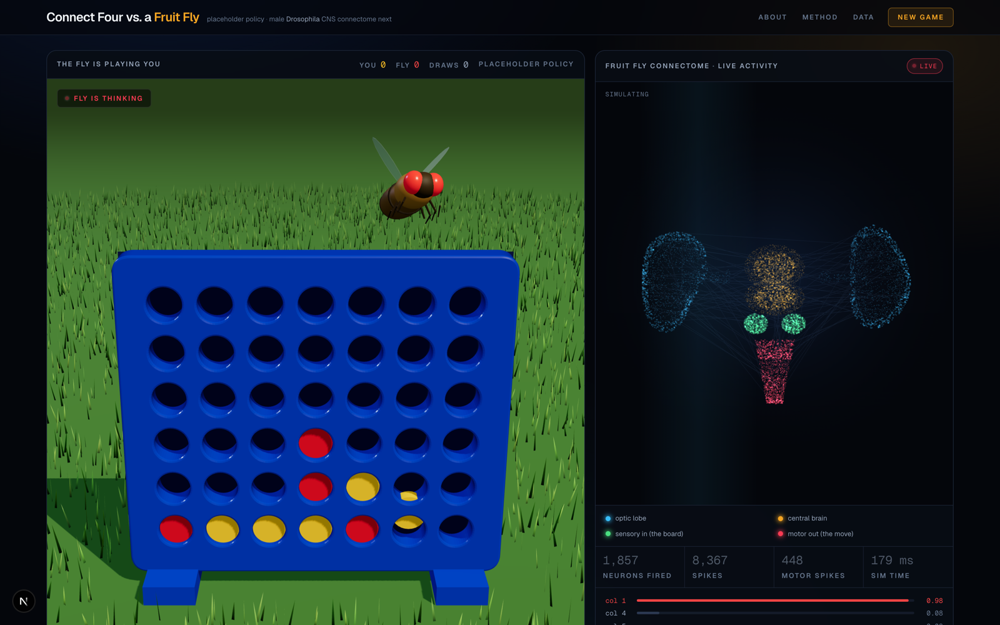

# Connect Four vs. a Fruit Fly

> Can you outsmart a fruit-fly-inspired neural opponent?

A playable Connect Four game against an opponent styled as a fruit fly, with a
live connectome-style activity panel that lights up while the fly decides.

**Read this first:** there is no connectome in this version. The fly currently
plays a hand-written heuristic, and the neuron/spike numbers in the activity
panel are synthetic values generated from the board position. The point of this
milestone is a complete, polished playable experience with a clean seam where a
real model will drop in. The app says so in its own UI, and so does this README.



---

## What the MVP does today

- A real-time 3D scene: the board stands in a grass field, chips fall into
  their slots under gravity, and a FlyBody-derived fruit fly waits across the
  board. Drag to orbit, click a column to drop.
- Full Connect Four: 6x7 board, human plays yellow and moves first, the fly
  plays red.
- Win detection in all four directions, draw detection, full-column rejection,
  and a restart flow with session counters for human wins, fly wins and draws.
- The fly's move comes from the Python backend over HTTP. The frontend never
  decides the fly's move.
- A turn runs: your chip drops, the game checks for a terminal state, the status
  becomes "FLY IS THINKING", the brain panel plays a staged activation, the
  backend answers, the fly carries one red chip to the chosen column, releases
  it into the board, returns to rest, and control returns to you. Input is
  blocked for the whole fly turn.
- The right-hand panel animates a synthetic bilateral point cloud of about nine
  thousand points: green sensory clusters fire first, activity spreads out to
  the blue optic lobe shells and the amber central brain, then the red motor
  column fires and everything settles.
- After each fly move the panel lists what the fly thought of every column,
  taken straight from the score vector the API returns.
- Keyboard and screen-reader support: a 3D canvas cannot be tabbed through, so
  the status bar carries real buttons for columns 1 to 7 and they are the
  supported keyboard path. Status changes are announced through an `aria-live`
  region, full columns are disabled, and focus rings are visible throughout.
- If the browser cannot provide a WebGL context the game falls back to a flat
  CSS board rather than showing a dead panel.

## What is a placeholder

| Piece | Today | Next milestone |
|---|---|---|
| Fly policy | Hand-written heuristic in `backend/game/bot.py` | Sparse network whose connectivity comes from a fruit-fly connectome |
| `neurons_fired`, `spikes`, `motor_spikes`, `sim_time_ms` | Deterministic synthetic values derived from the board | Measurements from the actual network run |
| Brain visualisation | Original synthetic point cloud, fly-brain-shaped | Node positions and edges from real connectome data |

The API response schema will not change when those swaps happen. That is the
whole design constraint of this milestone.

### How the placeholder bot plays

In priority order:

1. If the fly can win immediately, it takes the win.
2. If the human can win next move, it blocks.
3. It heavily avoids any move that hands the human a win directly on top of it.
4. Everything else is scored with a windowed positional heuristic (own threes
   and twos up, opponent threes down) plus a pull toward the centre column.
5. Ties are broken uniformly at random, so repeated games differ.

It beats a random opponent 200 games out of 200, which is roughly the level this
milestone wants: good enough that beating it feels earned, simple enough that no
one mistakes it for a neural model.

---

## Architecture

```
frontend/                     Next.js 16 + React 19 + TypeScript + Tailwind v4
  app/
    layout.tsx                Fonts, metadata, dark theme shell
    page.tsx                  Composes the panels, holds the health probe
    globals.css               Design tokens, keyframes, reduced-motion rules
  components/
    TopNav.tsx                Title, About/Method/Data notes, PLAY / NEW GAME
    GamePanel.tsx             Scene host, status badge, winner banner, score
    GameScene.tsx             Loads the 3D scene, falls back without WebGL
    ConnectFourBoard.tsx      Flat CSS board, used only as that fallback
    FruitFly.tsx              Stylised fruit fly in SVG, for the same fallback
    BrainActivityPanel.tsx    Title, LIVE/IDLE, legend, stats, column scores
    ConnectomeCanvas.tsx      The animated point cloud (canvas 2D)
    StatusBar.tsx             State, instruction, accessible column buttons
    scene/
      Scene.tsx               Canvas, lights, fog, orbit controls
      CameraRig.tsx           Frames the board at any aspect ratio
      Board3D.tsx             Extruded frame with 42 holes punched through
      Chips.tsx               Falling chips with a settle bounce
      ColumnPicker.tsx        Pointer targets, hover ghost, drag/click split
      Grass.tsx               Instanced grass field, one draw call
      constants.ts            Shared board geometry and fly column anchors
    FlyActor/
      FlyActor.tsx            Embodied fly body and carried piece ownership
      FlyBodyModel.tsx        Loads the FlyBody-derived GLB and wing pivots
      useFlyAnimation.ts      Body state machine and frame-by-frame motion
      flyStates.ts            Fly phases and future motor request shape
  lib/
    types.ts                  Board and API types; mirrors the backend schema
    game.ts                   Client-side mirror of the rules, for instant UI
    api.ts                    The only place that talks to the backend
    status.ts                 Status labels, hints and announcements
    motion.ts                 prefers-reduced-motion hook for scene motion
    useConnectFour.ts         Turn flow: drop, evaluate, fly turn, terminal state

tools/
  flybody/
    convert_flybody.py        One-time FlyBody OBJ/XML to GLB converter
    source_manifest.json      Source files, modifications and omissions
    README.md                 Reproducible conversion notes

backend/                      Python 3.13 + FastAPI
  main.py                     Routes and request/response schemas only
  game/
    logic.py                  Canonical rules. No framework imports.
    bot.py                    The placeholder heuristic policy
  models/
    placeholder.py            FlyModel protocol + the placeholder implementation
  tests/                      45 tests across rules, bot and API
```

Two rules keep this tidy:

- **Game logic never imports FastAPI.** `backend/game/logic.py` is plain Python
  and is what the tests exercise.
- **The frontend only ever calls `requestFlyMove`.** Swapping the model behind
  `/move` requires no frontend change at all.

The frontend keeps its own copy of the rules in `lib/game.ts` so hover previews,
chip landings and win highlighting are instant. The backend is the authority and
its test-suite is what pins the rules down.

### Embodied Fly

The game policy selects a Connect Four move, and a FlyBody-derived anatomical
fly visualization executes the corresponding embodied animation. The body layer
receives only the chosen column today:

```
Connect Four board
      ↓
Fly decision model
      ↓
chosen column
      ├── live neural visualization
      └── FlyBody-derived embodied animation
             ↓
          piece drop
```

The frontend keeps these systems separate:

- **Brain / decision:** the backend returns `column = 0..6`, score telemetry and
  synthetic activity through the existing `/move` contract.
- **Body / animation:** `FlyActor` turns that column into
  `idle -> thinking -> pickup -> travel -> hover -> release -> return`.
- **Game:** Connect Four rules and board state remain authoritative in the
  existing game layer.

To avoid duplicate red pieces, the fly's move is first stored as a pending move.
The board does not render that chip while the fly is carrying it. At the release
frame, `FlyActor` calls `commitFlyMove()`, the carried chip disappears, and the
real board chip starts the existing drop animation from the same height.

This is authored animation, not connectome motor control. The current body
motion is not generated by FlyBody physics, FlyWire neurons, biological motor
neurons or a real fly motor system. Future work can replace `playFlyMove(column)`
with a richer request such as `{ column, neuralActivity, motorState, confidence }`
without rewriting the scene.

#### FlyBody asset pipeline

The visible fly body is derived from
[TuragaLab/flybody](https://github.com/TuragaLab/flybody), an
anatomically-detailed MuJoCo model of the adult *Drosophila melanogaster* from
the Turaga Lab at HHMI Janelia Research Campus with Google DeepMind. The source
repository is Apache 2.0 and cites the associated DeepMind / Janelia work,
“Whole-body physics simulation of fruit fly locomotion.”

Only browser visualization assets are checked in. The converter uses
`flybody/fruitfly/assets/fruitfly.xml` for the kinematic tree, geom transforms,
materials and mesh scale, plus the visual OBJ meshes in
`flybody/fruitfly/assets/*.obj`. Those assets include recognizable head,
compound eyes, thorax, abdomen, wings and legs as separate anatomical meshes in
the MuJoCo model.

```
FlyBody fruitfly.xml + visual OBJ meshes
        ↓
tools/flybody/convert_flybody.py
        ↓
frontend/public/models/flybody.glb
        ↓
Three.js / React Three Fiber FlyActor
```

The conversion bakes the default pose, skips MuJoCo collision volumes, groups
meshes by material, decimates the geometry, converts from MuJoCo Z-up to glTF
Y-up, recenters and scales the model, maps flat MuJoCo materials to glTF PBR
materials, and splits the wings into hinge-relative nodes for animation. The
browser does not load MuJoCo, TensorFlow, Acme, FlyBody Python code or any
physics runtime.

The checked-in result is `frontend/public/models/flybody.glb`: one 874 KB GLB
with 48,289 output faces, 8 materials, and three logical nodes (`body`,
`wing_left`, `wing_right`). The source checkout is not vendored; rerun
`tools/flybody/convert_flybody.py` against a local FlyBody clone to reproduce
the asset. The upstream license and notice of modification ship beside the
model in `frontend/public/models/LICENSE-flybody.txt`.

### The seam for the real model

`backend/models/placeholder.py` defines the contract:

```python
class FlyModel(Protocol):
    def predict(self, board, player=FLY) -> PolicyOutput: ...
```

`PolicyOutput` carries the chosen column, a 7-wide score vector, and an
`ActivityTrace`. To promote a trained model, implement that one method and return
it from `get_fly_model()`. Nothing else moves.

### API

| Method | Path | Purpose |
|---|---|---|
| `GET` | `/health` | Liveness, plus which policy is loaded |
| `POST` | `/new-game` | A fresh empty board |
| `POST` | `/move` | The fly's move for a position |
| `GET` | `/docs` | Interactive OpenAPI docs |

`POST /move` request:

```json
{ "board": [[0,0,0,0,0,0,0], "... 6 rows total, row 0 is the top ..."] }
```

Response:

```json
{
  "column": 3,
  "scores": [0.08, 0.30, 0.52, 0.98, 0.52, 0.30, 0.08],
  "activity": {
    "neurons_fired": 1875,
    "spikes": 7392,
    "motor_spikes": 454,
    "sim_time_ms": 185
  },
  "model": "placeholder-heuristic",
  "notes": "Placeholder heuristic policy. Activity telemetry is synthetic ..."
}
```

Board values are `0` empty, `1` human, `-1` fly. Malformed boards (wrong shape,
unknown values, pieces floating above a gap) return `422`; a finished game
returns `409`.

---

## Local setup

Requires Python 3.11+ and Node 18.18+. Two terminals.

### Backend

```bash
cd backend
python3 -m venv .venv
source .venv/bin/activate
pip install -r requirements.txt
uvicorn main:app --reload --port 8000
```

Check it: `curl localhost:8000/health`

### Frontend

```bash
cd frontend
npm install
npm run dev
```

Open http://localhost:3000.

The 3D scene uses `three`, `@react-three/fiber` and `@react-three/drei`. They
are the only runtime dependencies beyond Next and React, and the scene chunk is
loaded on demand so the rest of the page does not wait on it.

If the backend runs somewhere other than `http://localhost:8000`, set
`NEXT_PUBLIC_API_URL` in `frontend/.env.local`, and set `CORS_ORIGINS` on the
backend if the frontend is not on `http://localhost:3000`.

### Commands

| Where | Command | What |
|---|---|---|
| `backend/` | `pytest` | Run the test-suite |
| `backend/` | `uvicorn main:app --reload --port 8000` | Dev server |
| `frontend/` | `npm run dev` | Dev server |
| `frontend/` | `npm run build` | Production build |
| `frontend/` | `npm run lint` | ESLint |
| `frontend/` | `npx tsc --noEmit` | Type check |

## Tests

```bash
cd backend && pytest
```

45 tests covering: horizontal, vertical and both diagonal wins; full-column
rejection; legal-move detection; draw detection on an exhaustively-searched full
board; board validation; the bot always returning a legal move across 40 random
playouts; the bot taking an immediate win; the bot blocking an immediate human
win; the score vector's shape and range; and the API's success, validation and
conflict paths.

---

## Roadmap

**1. Replace the heuristic with a connectome-derived model.** Load a
*Drosophila* connectome, derive a sparse connectivity mask, and train a policy
whose weights are only allowed to be non-zero where the fly has a synapse.
Implement `FlyModel.predict` and return real per-column scores.

**2. Report real activity.** Replace `synthesize_activity` with counts taken
from the forward pass, so `neurons_fired`, `spikes`, `motor_spikes` and
`sim_time_ms` mean something. Drive the visualisation from a real activation
vector rather than a scripted wave.

**3. Draw the real topology.** Project actual neuron coordinates into the
canvas so the point cloud is the fly's brain rather than an evocation of it.
The regions, colours and staging are already in place to receive them.

**4. Comparison study.** Train three opponents on the same task and the same
budget, then measure them against each other:

- real fly topology,
- randomised topology with matched degree distribution,
- a conventional dense network.

The question is whether the fly's wiring is merely sparse or actually useful.

**5. Lesion mode.** Let the player disable regions of the connectome mid-game
and watch the fly get worse, with the activity panel showing the dead tissue.
This is the feature the whole architecture is aiming at, and it only means
something once the topology is real.

## Honesty policy

If a number on screen is synthetic, the UI says so. The claim "connectome-
inspired" in the header is doing real work, and the panel underneath spells out
what is and is not running. Please keep it that way as the model lands.

## License

MIT. See [LICENSE](LICENSE).
